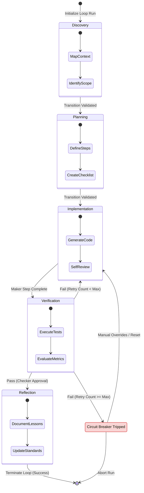
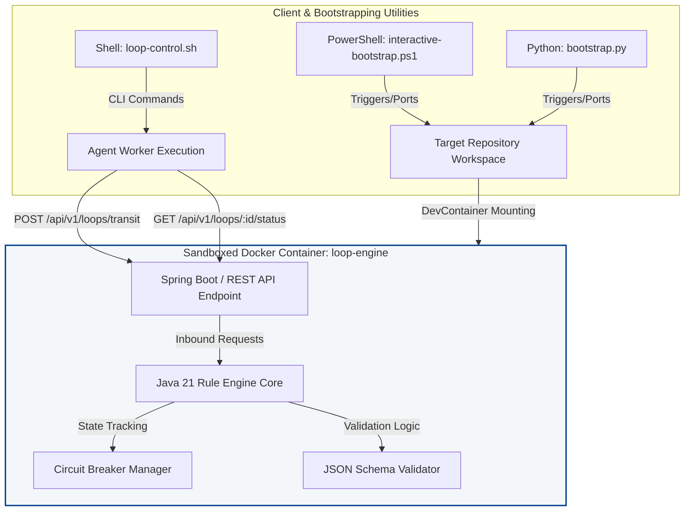
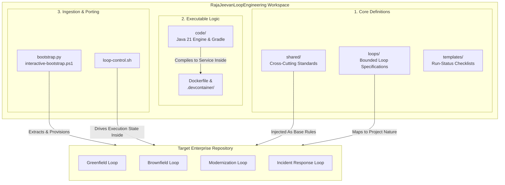

# RajaJeevanLoopEngineering Framework

**Version:** 1.0.0  
**License:** MIT  
**Target Platform:** Java 21+ & Any Language-Agnostic Agent Framework  

Welcome to the **RajaJeevanLoopEngineering** repository. This repository provides the infrastructure, guidelines, specifications, execution templates, and utility code for executing and auditing structured AI agent workflows.

Rather than executing open-ended prompts, this framework enables software developers and stakeholders to codify agent processes into formal, state-bound, auditable execution loops governed by the **Maker/Checker** pattern and human oversight.
---


---






---
The **[RajaJeevanLoopEngineering framework](https://github.com/rjmad1/RajaJeevanLoopEngineering)** is designed to solve a major problem with AI coding agents: **unpredictability**.

When developers let AI agents write or fix code without boundaries, the AI can sometimes go off track, make bad assumptions, or create loops that waste time and computing power. This repository introduces strict discipline to that process.

Here is what it accomplishes for the software engineering community in simple terms:

---

## 1. Enforces a "Maker/Checker" Routine

Instead of letting an AI agent blindly write and commit code, this framework forces it to follow a structured process. One agent or step proposes the change (the **Maker**), and another distinct phase or human must validate and approve it (the **Checker**). This keeps AI-generated code safe and reliable.

## 2. Replaces Open-Ended Prompts with State-Bound Loops

Instead of engineers typing random prompts, the framework organizes work into formal, auditable execution loops. The agent transitions through explicit steps like **Discovery $\rightarrow$ Planning $\rightarrow$ Implementation $\rightarrow$ Verification $\rightarrow$ Reflection**.

## 3. Includes a Built-In Circuit Breaker

If an AI agent gets stuck in an infinite loop, keeps repeating the same mistake, or fails verification tests multiple times, a containerized Java state engine acts as a **circuit breaker**. It automatically trips, stops the agent from burning resources, and alerts a human operator.

## 4. Offers Project-Specific Blueprints

Software development isn't one-size-fits-all. The framework includes specialized loop configurations depending on the nature of the project:

* **Greenfield:** Setting up architecture, documentation, and test infrastructure for brand new projects.
* **Brownfield:** Safely adding features or refactoring legacy code without breaking existing systems.
* **Modernization:** Decoupling older systems and verifying new API contracts.
* **Incident Response:** Quickly setting up tests to reproduce, hotfix, and verify production bugs.

## 5. Seamless Bootstrapping

It provides simple PowerShell and Python scripts that let developers instantly "port" this entire governance setup, along with a containerized REST API, directly into any existing repository.

---

> **The Takeaway:** It shifts AI engineering from an uncontrolled "Wild West" of unpredictable prompting into a structured, auditable, and safe assembly line.

---
## 🛠️ Instant Porting & Bootstrapping

We provide an interactive, single-command utility to port the loop infrastructure and container configurations directly to any target repository.

### Quick Start (PowerShell CLI)

Run the interactive bootstrap script from your terminal:

```powershell
.\interactive-bootstrap.ps1
```

The script will ask you **only two questions**:
1. **Target Project Location:** The absolute local path to your project folder (e.g. `C:\Users\rajaj\Projects\my-app`).
2. **Project Nature:** Select your project track:
   - `[1] Greenfield` — ADR designs, architecture mapping, documentation, test setup.
   - `[2] Brownfield` — Context assembly, regression testing, safe implementation, verification, refactoring.
   - `[3] Modernization` — System discovery, code review, decoupling, API contract verification.
   - `[4] Incident Response` — Reproduction test setups, hotfixing, targeted verification, post-mortems.
   - `[5] All Loops` — Installs the complete loop catalog.

### What is Configured?

The script automatically ports:
*   **Contextual Loops:** Copies only the necessary `.md` loop definitions to `docs/loops/<category>/`.
*   **General Standards:** Provisions cross-cutting standards to `docs/loops/shared/`.
*   **Customization Files:** Sets up `.agents/AGENTS.md` and templates for tasks and checklists.
*   **Rule Engine Java Code:** Copies the `RajaJeevanLoopEngineering/code` and a standalone Gradle wrapper for local testing.
*   **Dev Container Workspace:** Creates `.devcontainer/devcontainer.json` and a setup script to compile and test files automatically on startup.

---

## 📂 Directory Structure

*   **[`shared/`](shared/)** — Cross-cutting engineering standards, principles, naming conventions, and metrics.
*   **[`loops/`](loops/)** — Bounded loop specifications across different domains:
    *   **[`core/`](loops/core/)** — Foundational loops (Discovery, planning, implementation, verification, reflection).
    *   **[`engineering/`](loops/engineering/)** — Routine engineering tasks (Bug fixing, refactoring, testing).
    *   **[`platform/`](loops/platform/)** — Generalized integration and contract validations.
    *   **[`governance/`](loops/governance/)** — ADR generation, compliance reviews, release gates.
*   **[`templates/`](templates/)** — Document structures for authoring new loops, skills, or run-status indicators.
*   **[`examples/`](examples/)** — Sample execution logs demonstrating complete runs.
*   **[`recipes/`](recipes/)** — Copy-paste prompts and configs for agent personas.
*   **[`code/`](code/)** — Decoupled Java rule engine and circuit-breaker execution utilities.
*   **[`docs/`](docs/)** — In-depth conceptual, architectural, and troubleshooting guides.

---

## 🏁 Bootstrapping & Containerised Loop Engine

### 1. Cross-Platform Bootstrapping (Python 3)
In addition to PowerShell, a cross-platform Python onboarding script is available:
```bash
python3 bootstrap.py
```
This utility copies loop definitions, configures standard templates, ports the Java rule engine, and generates secure Dev Container workspaces natively across Linux, macOS, and Windows.

### 2. Run the Containerised State Engine (Docker)
Build and run the loop engine inside a sandboxed container:
```bash
# Build target Docker image
docker build -t loop-engine .

# Run the container (exposes REST API on port 8080)
docker run -p 8080:8080 loop-engine
```
The container runs as a low-privilege, non-root user with dropped capabilities, preventing arbitrary shell command execution.

### 3. Agnostic State Transition REST API
The state engine exposes language-neutral endpoints on port `8080`:

*   **`POST /api/v1/loops/transit`** — Submit phase transitions (e.g. `IMPLEMENTATION` to `VERIFICATION`) for validation and circuit breaker checks.
*   **`GET /api/v1/loops/{loopId}/status`** — Query current phase, check if the circuit breaker is tripped, and receive recommended next actions.
*   **`GET /health`** — Container liveness probe.

### 4. Agnostic Shell Client (`loop-control.sh`)
Submit transitions easily from any Python worker, CI/CD pipeline, or shell script:
```bash
# Transition state
./loop-control.sh transit my-loop IMPLEMENTATION VERIFICATION

# Check state status
./loop-control.sh status my-loop
```

---

## 📖 Wiki Documentation

For in-depth explanations of the loop theory, classification matrices, and operational guides, visit the official [GitHub Wiki](https://github.com/rjmad1/RajaJeevanLoopEngineering/wiki).

