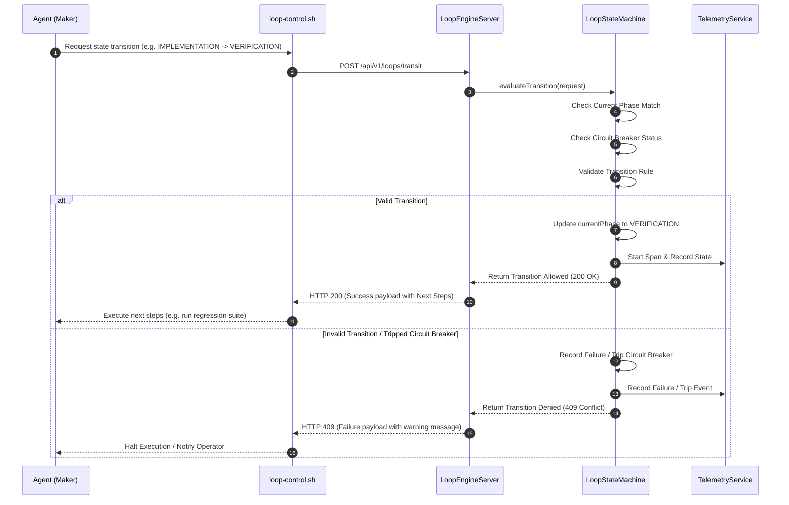
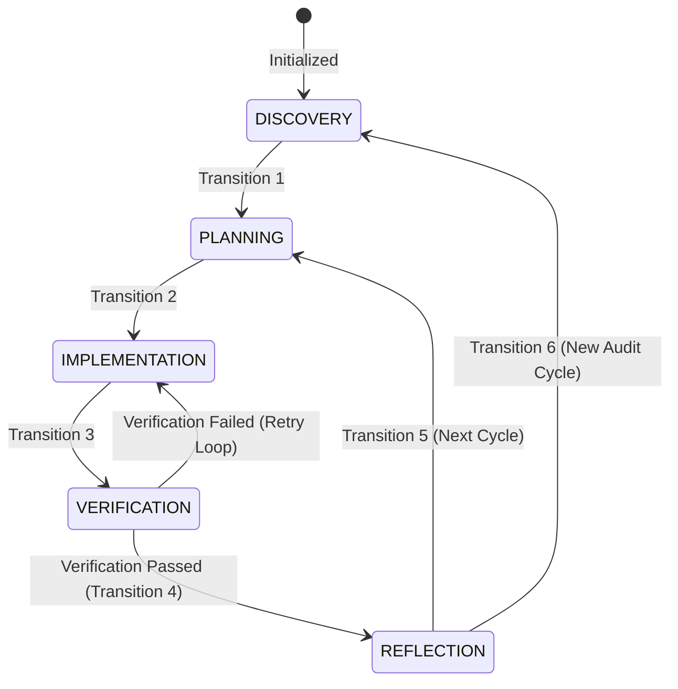

# RajaJeevanLoopEngineering Framework — Enterprise-Grade User Guide

Welcome to the definitive user guide and playbook for the **RajaJeevanLoopEngineering Framework**. This document serves as the primary reference for software developers, architects, product managers, technical program managers, QA engineers, DevOps engineers, and AI engineers working on or extending this repository.

---

## 1. Executive Summary

### 1.1 Project Overview & Business Objective
The **RajaJeevanLoopEngineering Framework** is an enterprise-grade, technology-agnostic system for defining, executing, and auditing structured AI agent workflows. In modern software organizations, AI agents are increasingly tasked with code generation, security analysis, test generation, and database refactoring. However, executing AI prompts in an open-ended, free-form manner introduces severe risks:
- **Drift and Hallucination:** AI agents lack state boundaries and drift away from architectural requirements.
- **Uncontrolled Operations:** Agents write directly to shared codebases or external systems without independent safety gates.
- **Lack of Auditability:** There is no machine-readable trail of what an AI did, what checks were run, and who approved the changes.

To solve this, the RajaJeevanLoopEngineering Framework implements the **Maker/Checker pattern** and **Human Oversight Gates** to model agent operations as deterministic, state-bound, and auditable loops. 

### 1.2 Vision & Core Capabilities
Rather than replacing developers or writing loose prompts, this framework enables organizations to treat AI actions as formal **Loop Runs** that transit through standardized phases. Key capabilities include:
- **Cross-Platform Bootstrapping:** Provisioning target repositories with customized loop configurations depending on project nature (Greenfield, Brownfield, Modernization, Incident Response).
- **Agnostic State Transition Engine:** A containerized Java REST API that validates transitions, records immutable audit trails, and tracks loop failure statistics.
- **Circuit Breaking:** Auto-tripping execution loops when consecutive failures exceed defined safety thresholds, preventing infinite agent loops and resource-draining execution runs.
- **Strict Compliance Verification:** Machine-checkable Level 1 assertions and Level 2 Checker assessments ensuring zero self-attestation.

### 1.3 Intended Audience
- **AI / Loop Engineers:** Developers building agents that call the Loop Engine API to assert state transitions.
- **Software Engineers & Architects:** Team members executing loops to automate bug fixing, refactoring, and ADR writing, and ensuring compliance.
- **Product Managers & TPMs:** Stakeholders who define quality boundaries, manage release criteria, and map capabilities to business outcomes.
- **DevOps & QA Engineers:** Engineers monitoring the containerized state engine, setting up Dev Containers, and validating test suites.

---

## 2. Getting Started

This section guides you through installing, configuring, running the engine, and executing your first loop transition.

### 2.1 Prerequisites
- **Operating System:** Windows, macOS, or Linux.
- **Java Development Kit (JDK):** Version 21 or higher (required to build the core rule engine).
- **Python:** Python 3.10+ (for cross-platform bootstrapping).
- **PowerShell:** PowerShell 5.1+ or Core (optional, for Windows interactive bootstrapping).
- **Docker:** (Optional) For running the state engine inside a sandboxed container.

### 2.2 Installation & Environment Setup
Clone the repository to your local machine:
```bash
git clone https://github.com/rjmad1/RajaJeevanLoopEngineering.git
cd RajaJeevanLoopEngineering
```

Verify that the local build compiles and passes unit tests:
```bash
# On Unix-like systems
./gradlew -p code test

# On Windows (PowerShell)
.\gradlew.bat -p code test
```

### 2.3 Bootstrapping a Target Project
To port the framework to a target repository, run either the Python or PowerShell bootstrapping script.

#### Option A: Cross-Platform Python Utility (Recommended)
```bash
python3 bootstrap.py
```
1. Enter the absolute path to your target project folder (e.g., `C:\Users\rajaj\Projects\my-target-app`).
2. Select your project track (e.g., `1` for Greenfield, `2` for Brownfield, etc.).

#### Option B: Interactive PowerShell Utility
```powershell
.\interactive-bootstrap.ps1
```

### 2.4 Running the State Engine Locally

#### Running via Gradle
You can run the engine directly from source:
```bash
# On Unix-like systems
./gradlew -p code run

# On Windows (PowerShell)
.\gradlew.bat -p code run
```
By default, the server starts on port `8080`.

#### Running via Docker
Build and run the loop engine inside a secure, non-root Docker container:
```bash
docker build -t loop-engine .
docker run -p 8080:8080 loop-engine
```

### 2.5 First Successful Execution (Verification Checklist)
To verify your installation, interact with the state engine using the CLI wrapper script `loop-control.sh`:

1. **Verify Health:**
   ```bash
   ./loop-control.sh health
   ```
   **Expected Response:**
   ```json
   { "status": "UP" }
   ```

2. **Submit a Transition:**
   Transit a loop named `my-test-loop` from `DISCOVERY` to `PLANNING`:
   ```bash
   ./loop-control.sh transit my-test-loop DISCOVERY PLANNING
   ```
   **Expected Response:**
   ```json
   {
     "transition_allowed": true,
     "current_state": "PLANNING",
     "next_steps": [
       "Scan repository structure",
       "Catalogue APIs and dependencies"
     ],
     "circuit_breaker": {
       "tripped": false,
       "current_failures": 0,
       "threshold": 3
     },
     "message": "Transition accepted: DISCOVERY → PLANNING"
   }
   ```

3. **Check Status:**
   ```bash
   ./loop-control.sh status my-test-loop
   ```
   **Expected Response:**
   ```json
   {
     "transition_allowed": true,
     "current_state": "PLANNING",
     "next_steps": [
       "Scan repository structure",
       "Catalogue APIs and dependencies"
     ],
     "circuit_breaker": {
       "tripped": false,
       "current_failures": 0,
       "threshold": 3
     },
     "message": "Loop status: PLANNING"
   }
   ```

---

## 3. Repository Overview

### 3.1 Folder Structure Walkthrough
```
RajaJeevanLoopEngineering/
├── .devcontainer/          # Workspace configuration for secure sandbox environments
├── code/                   # Core Java source, tests, and build configurations
│   ├── src/main/java/      # Production classes for State Machine, CLI, Server, Compiler, Telemetry
│   └── src/test/java/      # JUnit 5 integration and unit verification tests
├── docs/                   # Conceptual playbooks and system validation reports
├── loops/                  # Executable loop definitions grouped by category
│   ├── core/               # Standard SDLC loops (LOOP-001 through LOOP-007)
│   ├── engineering/        # Routine code maintenance tasks (LOOP-101 through LOOP-105)
│   ├── platform/           # Non-functional validation runs (LOOP-201 through LOOP-207)
│   ├── governance/         # Organizational compliance and ADR gates (LOOP-301 through LOOP-304)
│   └── release/            # Pre-deployment validation gates (LOOP-401 through LOOP-403)
├── recipes/                # Copy-paste agent guidelines and task descriptions
├── shared/                 # Canonical standards, oversight specifications, and loop manifests
└── templates/              # Standard markdown blueprints for reviews, checklists, and status indicators
```

### 3.2 Module Responsibilities & Key Files
- `shared/LOOP-STANDARD.md`: The governing specification document that defines loop structure, headers, naming rules, and mandatory sections.
- `shared/SPEC-001-LOOP-CONTRACTS.md`: Outlines the technical definitions of inputs, outputs, and validation thresholds.
- `shared/SPEC-005-Metrics.md`: Dictates the snake_case naming rules, storage targets, and mandatory metrics for loop execution.
- `shared/loops-manifest.json`: Map matching Greenfield, Brownfield, Modernization, and Incident Response project tracks to their specific subset of loops.
- `code/src/main/java/com/rajajeevan/loop/spec/LoopSpecCompiler.java`: Compiles YAML/JSON specifications into strict, conformant Markdown documentation templates.
- `code/src/main/java/com/rajajeevan/loop/engine/LoopStateMachine.java`: Enforces transition restrictions, updates consecutive failures, and evaluates circuit-breaking triggers.
- `bootstrap.py` & `interactive-bootstrap.ps1`: Automated, dependency-free utilities for initializing the loop engineering setup in any external project folder.

---

## 4. Architecture Guide

### 4.1 System Boundaries & Component Interactions
The RajaJeevanLoopEngineering Framework decouples the **Declarative Loop Specifications** (written in Markdown/JSON) from the **Imperative State Engine** (written in Java). Agents and human reviewers write files to a repository, while the State Engine tracks execution states in-memory or in containers, providing API access.



### 4.2 State Transition Lifecycle
The Loop Engine enforces a strict sequence of state transitions to prevent agents from skipping testing or reflection:



- **DISCOVERY:** Identify codebase layout, interfaces, and limitations.
- **PLANNING:** Formulate the step-by-step modification plan and define target tests.
- **IMPLEMENTATION:** Author code changes and compile files.
- **VERIFICATION:** Execute unit, integration, and contract tests.
- **REFLECTION:** Evaluate metrics, record anomalies, write retrospective, and register learnings.

### 4.3 Core Architectural Decisions
1. **Language-Neutral API:** The state engine is written in Java 21 using Javalin but exposes a REST API, enabling integration with any agent framework (Python, TypeScript, LangChain, Autogen, or Bash).
2. **In-Memory Thread-Safe State:** Loop states are stored in a `ConcurrentHashMap` inside `LoopStateMachine`. State is transient and reset when the server restarts.
3. **OpenTelemetry Integration:** Out-of-the-box telemetry logging tracks transit timings and exception traces directly, providing structured observability.
4. **Sandboxed Containers:** The provided Docker environment drops kernel capabilities (`--cap-drop=all`) and blocks privilege escalation, isolating the executor.

---

## 5. Functional Overview

The repository defines 5 categories of execution loops under the `loops/` folder, each serving a unique functional requirement.

### 5.1 Category Ranges
| Loop ID Range | Category | Purpose | Example |
|---|---|---|---|
| **LOOP-001–099** | **Core** | Base SDLC phases for agent execution | `loops/core/LOOP-001-Architecture-Discovery.md` |
| **LOOP-101–199** | **Engineering** | Routine code maintenance activities | `loops/engineering/LOOP-101-Bug-Fixing.md` |
| **LOOP-201–299** | **Platform** | Non-functional validation runs | `loops/platform/LOOP-201-Workflow-Validation.md` |
| **LOOP-301–399** | **Governance** | Organizational compliance and ADR gates | `loops/governance/LOOP-301-ADR-Generation.md` |
| **LOOP-401–499** | **Release** | Deployment checks and post-release audits | `loops/release/LOOP-401-Release-Checklist.md` |
| **LOOP-110** | Legacy Strangler | Engineering | Medium | LOOP-002 — Context Assembly, LOOP-004 — Planning, LOOP-006 — Verification | Auto-generated standard template execution for Legacy Strangler. |
| **LOOP-111** | Technical Debt Remediation | Engineering | Medium | LOOP-002 — Context Assembly, LOOP-004 — Planning, LOOP-006 — Verification | Auto-generated standard template execution for Technical Debt Remediation. |
| **LOOP-112** | Component Deprecation Lifecycle | Engineering | Medium | LOOP-002 — Context Assembly, LOOP-004 — Planning, LOOP-006 — Verification | Auto-generated standard template execution for Component Deprecation Lifecycle. |
| **LOOP-113** | Dead Code Elimination | Engineering | Medium | LOOP-002 — Context Assembly, LOOP-004 — Planning, LOOP-006 — Verification | Auto-generated standard template execution for Dead Code Elimination. |
| **LOOP-130** | Localization and Internationalization Audit | Engineering | Medium | LOOP-002 — Context Assembly, LOOP-004 — Planning, LOOP-006 — Verification | Auto-generated standard template execution for Localization and Internationalization Audit. |
| **LOOP-150** | Dependency Patching | Engineering | Medium | LOOP-002 — Context Assembly, LOOP-004 — Planning, LOOP-006 — Verification | Auto-generated standard template execution for Dependency Patching. |
| **LOOP-160** | Database Deadlock Resolution | Engineering | Medium | LOOP-002 — Context Assembly, LOOP-004 — Planning, LOOP-006 — Verification | Auto-generated standard template execution for Database Deadlock Resolution. |
| **LOOP-161** | Memory Leak Detection | Engineering | Medium | LOOP-002 — Context Assembly, LOOP-004 — Planning, LOOP-006 — Verification | Auto-generated standard template execution for Memory Leak Detection. |
| **LOOP-170** | Zero-Trust Token Rotation | Engineering | Medium | LOOP-002 — Context Assembly, LOOP-004 — Planning, LOOP-006 — Verification | Auto-generated standard template execution for Zero-Trust Token Rotation. |
| **LOOP-171** | Secrets Lifecycle Enforcement | Engineering | Medium | LOOP-002 — Context Assembly, LOOP-004 — Planning, LOOP-006 — Verification | Auto-generated standard template execution for Secrets Lifecycle Enforcement. |
| **LOOP-180** | Environment Drift Audit | Engineering | Medium | LOOP-002 — Context Assembly, LOOP-004 — Planning, LOOP-006 — Verification | Auto-generated standard template execution for Environment Drift Audit. |
| **LOOP-181** | Container Layer Optimization | Engineering | Medium | LOOP-002 — Context Assembly, LOOP-004 — Planning, LOOP-006 — Verification | Auto-generated standard template execution for Container Layer Optimization. |
| **LOOP-305** | Telemetry Compliance | Governance | Medium | LOOP-006 — Verification | Auto-generated standard template execution for Telemetry Compliance. |
| **LOOP-306** | SaaS Cost Optimization | Governance | Medium | LOOP-007 — Reflection | Auto-generated standard template execution for SaaS Cost Optimization. |
| **LOOP-307** | Regulatory Compliance Drift | Governance | Medium | LOOP-006 — Verification | Auto-generated standard template execution for Regulatory Compliance Drift. |
| **LOOP-308** | Contract-to-Code Enforcement | Governance | Medium | LOOP-006 — Verification | Auto-generated standard template execution for Contract-to-Code Enforcement. |
| **LOOP-309** | License Compliance Audit | Governance | Medium | LOOP-006 — Verification | Auto-generated standard template execution for License Compliance Audit. |
| **LOOP-310** | Infrastructure Cost Attribution | Governance | Medium | LOOP-007 — Reflection | Auto-generated standard template execution for Infrastructure Cost Attribution. |
| **LOOP-311** | Feature Access Entitlement | Governance | Medium | LOOP-006 — Verification | Auto-generated standard template execution for Feature Access Entitlement. |
| **LOOP-312** | Data Privacy Anonymization | Governance | Medium | LOOP-006 — Verification | Auto-generated standard template execution for Data Privacy Anonymization. |
| **LOOP-205** | Multi-Tenant Isolation Audit | Platform | Medium | LOOP-006 — Verification | Auto-generated standard template execution for Multi-Tenant Isolation Audit. |
| **LOOP-206** | Observability Validation | Platform | Medium | LOOP-005 — Implementation | Auto-generated standard template execution for Observability Validation. |
| **LOOP-208** | Data Migration | Platform | Medium | LOOP-006 — Verification | Auto-generated standard template execution for Data Migration. |
| **LOOP-209** | Partner API Degradation | Platform | Medium | LOOP-006 — Verification | Auto-generated standard template execution for Partner API Degradation. |
| **LOOP-210** | API Shadow IT Discovery | Platform | Medium | LOOP-006 — Verification | Auto-generated standard template execution for API Shadow IT Discovery. |
| **LOOP-211** | FinOps Cloud Bursting | Platform | Medium | LOOP-006 — Verification | Auto-generated standard template execution for FinOps Cloud Bursting. |
| **LOOP-212** | Chaos Engineering Resilience | Platform | Medium | LOOP-006 — Verification | Auto-generated standard template execution for Chaos Engineering Resilience. |
| **LOOP-213** | Multi-Region State Sync | Platform | Medium | LOOP-006 — Verification | Auto-generated standard template execution for Multi-Region State Sync. |
| **LOOP-214** | Resource Quota Guardrail | Platform | Medium | LOOP-006 — Verification | Auto-generated standard template execution for Resource Quota Guardrail. |
| **LOOP-215** | Secret Leakage Prevention | Platform | Medium | LOOP-006 — Verification | Auto-generated standard template execution for Secret Leakage Prevention. |
| **LOOP-216** | Database Index Optimization | Platform | Medium | LOOP-006 — Verification | Auto-generated standard template execution for Database Index Optimization. |
| **LOOP-217** | System Event Idempotency | Platform | Medium | LOOP-006 — Verification | Auto-generated standard template execution for System Event Idempotency. |
| **LOOP-218** | Backward Compatibility Verification | Platform | Medium | LOOP-006 — Verification | Auto-generated standard template execution for Backward Compatibility Verification. |
| **LOOP-219** | Load Balancing Anomaly Mitigation | Platform | Medium | LOOP-006 — Verification | Auto-generated standard template execution for Load Balancing Anomaly Mitigation. |
| **LOOP-220** | API Rate Limiting Guardrail | Platform | Medium | LOOP-006 — Verification | Auto-generated standard template execution for API Rate Limiting Guardrail. |
| **LOOP-221** | Accessibility Compliance Guardrail | Platform | Medium | LOOP-006 — Verification | Auto-generated standard template execution for Accessibility Compliance Guardrail. |
| **LOOP-222** | Telemetry Anomaly Detection | Platform | Medium | LOOP-006 — Verification | Auto-generated standard template execution for Telemetry Anomaly Detection. |
| **LOOP-223** | Multi-Cloud Disaster Recovery | Platform | Medium | LOOP-006 — Verification | Auto-generated standard template execution for Multi-Cloud Disaster Recovery. |
| **LOOP-224** | Edge Cache Invalidation | Platform | Medium | LOOP-006 — Verification | Auto-generated standard template execution for Edge Cache Invalidation. |
| **LOOP-225** | Cross-Site Scripting Guardrail | Platform | Medium | LOOP-006 — Verification | Auto-generated standard template execution for Cross-Site Scripting Guardrail. |
| **LOOP-226** | Tenant Onboarding Validation | Platform | Medium | LOOP-006 — Verification | Auto-generated standard template execution for Tenant Onboarding Validation. |
| **LOOP-227** | Third-Party Webhook Reliability | Platform | Medium | LOOP-006 — Verification | Auto-generated standard template execution for Third-Party Webhook Reliability. |
| **LOOP-228** | Log Aggregation Sanity | Platform | Medium | LOOP-006 — Verification | Auto-generated standard template execution for Log Aggregation Sanity. |
| **LOOP-402** | Deployment Validation | Release | Medium | LOOP-401 — Release Checklist | Auto-generated standard template execution for Deployment Validation. |
| **LOOP-404** | Feature Flag Lifecycle | Release | Medium | LOOP-006 — Verification, LOOP-007 — Reflection | Auto-generated standard template execution for Feature Flag Lifecycle. |
| **LOOP-405** | Experimentation Guardrail | Release | Medium | LOOP-006 — Verification | Auto-generated standard template execution for Experimentation Guardrail. |
| **LOOP-406** | Edge Deployment Rollback | Release | Medium | LOOP-006 — Verification | Auto-generated standard template execution for Edge Deployment Rollback. |
| **LOOP-407** | Synthetic User Verification | Release | Medium | LOOP-006 — Verification | Auto-generated standard template execution for Synthetic User Verification. |

### 5.2 Functional Details of Core Workflows
1. **Discovery (`loops/core/LOOP-001` through `loops/core/LOOP-003`):** Scans the target workspace, maps dependency relationships, and catalogs existing configurations.
2. **Planning (`loops/core/LOOP-004`):** Compiles findings into an `implementation_plan.md` artifact. Requires human approval (Hard Gate) before proceeding.
3. **Implementation & Verification (`loops/core/LOOP-005` & `loops/core/LOOP-006`):** Coordinates code modification and runs Level 1 automated verifications (e.g. compilers, static analyzers, test execution).
4. **Reflection (`loops/core/LOOP-007`):** Analyzes duration, failures, and captures telemetry metrics, creating a `reflection.md` log.

### 5.3 Maker/Checker & Oversight Rules
Every loop relies on the separation of roles:
- **Maker Agent:** Responsible for generating the primary output artifact (e.g. code diff or document).
- **Checker Agent:** An independent instance that runs validation scripts and inspects the output against the spec.
- **Human Approval Gate:** A blocking point. For a **Hard Gate**, execution halts until manual sign-off is logged in the `STATUS.md` file. For a **Soft Gate**, execution proceeds automatically if no human objection is received within a timeout window (e.g. 10 minutes).

---

## 6. Developer Guide

This section describes how to develop, test, and extend the framework.

### 6.1 Creating a New Loop Definition
To author a new loop definition, follow the standard schema defined in `shared/LOOP-STANDARD.md`.

1. Create a markdown file under the appropriate category directory in `loops/` (e.g. `loops/engineering/LOOP-106-Custom-Task.md`).
2. Populate the required **Header Block**:
   ```markdown
   # LOOP-106 — Custom Task
   
   **Version:** 1.0  
   **Status:** Active  
   **Category:** Engineering  
   **Depends On:** None  
   **Human Gates:** Hard  
   ```
3. Populate all 23 required sections in order.

### 6.2 Compiling Loops from JSON/YAML Specifications
If you prefer declaring loops in JSON or YAML, you can compile them using `LoopSpecCompiler`:

1. Define the loop in a JSON/YAML file.
2. Compile the JSON file to a conformant Markdown document:
   ```bash
   # Usage: java com.rajajeevan.loop.spec.LoopSpecCompiler <input-spec-file> <output-markdown-file>
   .\gradlew.bat -p code run --args="my-spec.json loops/engineering/LOOP-106-Custom-Task.md"
   ```

### 6.3 Local Development Workflow & Coding Standards
- **Coding Style:** All Java code conforms to Google Java Format rules. Run spotless linter to verify formatting:
  ```bash
  .\gradlew.bat -p code spotlessCheck
  ```
  To auto-apply formatting:
  ```bash
  .\gradlew.bat -p code spotlessApply
  ```
- **Lombok Usage:** Use Lombok annotations (`@Getter`, `@Builder`, `@Data`, `@NoArgsConstructor`) to minimize boilerplate code.
- **Unit Testing:** Write JUnit 5 tests under `code/src/test/java/` to validate engine functionality. Ensure high test coverage:
  ```bash
  .\gradlew.bat -p code test
  ```

---

## 7. Product Manager Guide

This guide describes how product managers and stakeholders interact with the loop engine without deep-diving into code.

### 7.1 Business Capabilities & Value Realization
The framework provides tangible metrics that PMs can use to justify automation and safety improvements:

- **Verification Compliance:** Ensures that no code change reaches main without passing programmatic checks (Level 1) and peer review (Level 2).
- **Incident Mitigation:** Enforces strict preconditions and context assembly before an agent attempts a bug-fix, reducing the risk of bad hotfixes.
- **Audit Compliance:** Generates structured reflection files (`REFLECTION-NNN.md`) for every execution, simplifying compliance audits.

### 7.2 Core Capabilities Mapping to Project Lifecycle
PMs map loop executions to project tracks according to their goals:
- **Greenfield Track:** Standardizes architectural alignment (ADR writing) and sets up the documentation/testing standards before coding begins.
- **Brownfield Track:** Automates regression testing, safe refactoring, and ensures compliance with existing boundaries.
- **Modernization Track:** Identifies legacy system boundaries, executes code reviews, and validates API contracts before decoupling services.
- **Incident Response Track:** Automates reproduction test generation, hotfix testing, and enforces post-incident reflection.

### 7.3 KPIs & Telemetry
PMs track loop performance using key metrics aggregated by Governance loops:
- **Loop Success Rate:** Percentage of loop runs ending in `completed` vs `failed`.
- **Auto-Proceed Ratio:** Rate of Soft Gates that timed out and auto-proceeded without human objection (indicates gate noise or high confidence).
- **Circuit Breaker Trip Rate:** Number of times circuit breakers tripped (indicates agent instability or fragile test suites).

---

## 8. Configuration Reference

### 8.1 Dev Container Sandboxing Config (`.devcontainer/devcontainer.json`)
The Dev Container file configures the sandboxed developer environment:
- **Image:** `mcr.microsoft.com/devcontainers/universal:2` (includes standard developer tools).
- **Features:** Java 21, Docker-outside-of-Docker (enabling testing containerised processes).
- **Run Arguments:**
  - `--cap-drop=all`: Drops all Linux kernel capabilities.
  - `--security-opt=no-new-privileges`: Prevents helper tools inside the container from gaining root privileges.
- **Post-create Setup Script:** Runs `.devcontainer/devcontainer-setup.sh` to compile the Java rule engine and run tests upon container startup.

### 8.2 Project Bootstrap Variables
The bootstrapping script uses `shared/loops-manifest.json` to select loops for target projects. The manifest is categorized by track:
- **Greenfield:** Focuses on ADR, Documentation, Architecture Discovery, and Test Generation.
- **Brownfield:** Focuses on Context Assembly, Test Generation, Safe Implementation, and Verification.
- **Modernization:** Focuses on Architecture Discovery, Code Review, Refactoring, and API Contract Validation.
- **IncidentResponse:** Focuses on Context Assembly, Bug Fixing, Verification, and Reflection.

---

## 9. State Engine API Reference

The containerized Loop State Engine exposes a standard REST API on port `8080`.

### 9.1 POST /api/v1/loops/transit
Evaluates and executes a requested loop state transition.

- **Request Body Format (JSON):**
  ```json
  {
    "loop_id": "string (Required)",
    "source_phase": "string (Required)",
    "target_phase": "string (Required)",
    "artifacts": { "key": "value" },
    "execution_logs": "string"
  }
  ```
- **Response Format (JSON):**
  ```json
  {
    "transition_allowed": true,
    "current_state": "string",
    "next_steps": ["string"],
    "circuit_breaker": {
      "tripped": false,
      "current_failures": 0,
      "threshold": 3
    },
    "message": "string"
  }
  ```
- **Error Codes:**
  - `400 Bad Request`: Returned if required fields are missing or if the request body is malformed.
  - `409 Conflict`: Returned if the requested transition violates validation rules (e.g. out-of-order phase) or if the circuit breaker is tripped (OPEN).

### 9.2 GET /api/v1/loops/{loopId}/status
Retrieves the current state and circuit breaker details for a specific loop execution instance.

- **URL Parameter:** `loopId` (String)
- **Response Format (JSON):**
  ```json
  {
    "transition_allowed": true,
    "current_state": "string",
    "next_steps": ["string"],
    "circuit_breaker": {
      "tripped": false,
      "current_failures": 0,
      "threshold": 3
    },
    "message": "Loop status: CURRENT_PHASE"
  }
  ```
- **Error Codes:**
  - `404 Not Found`: Returned if the requested `loopId` has not been registered in memory.

### 9.3 GET /health
Liveness probe.
- **Response Format (JSON):**
  ```json
  { "status": "UP" }
  ```

---

## 10. Prompt Engineering & Agent Persona Reference

To automate loop execution, agent prompts must be structured to ingest loop specifications and interact with the state engine.

### 10.1 Agent Persona Templates (`recipes/`)
The `recipes/` folder contains copy-paste prompts that define roles for agents:
- `recipes/ai-agents.md`: Prompts to initialize AI agents with specific roles.
- `recipes/prompt-engineering.md`: Directives for structuring system prompts to align with loop standards.
- `recipes/enterprise.md`: Guidelines for mapping agent execution bounds to corporate compliance controls.
- `recipes/software-engineering.md`: Directives for coding and test-generation agents.

### 10.2 Prompt Structure & Variables
When executing a loop step (e.g. `PLANNING`), the orchestrator should inject the corresponding loop document into the agent's context window. System prompts must contain:
1. **State Engine Hook:** "Before executing any actions, invoke `./loop-control.sh transit {LOOP_ID} {SOURCE_PHASE} {TARGET_PHASE}`. If transition fails, stop immediately."
2. **Standard Variables:**
   - `{LOOP_ID}`: Matches the loop name (e.g. `LOOP-101`).
   - `{TARGET_DIR}`: The directory where artifacts are modified.
   - `{CHECKLIST_TEMPLATE}`: The path to `templates/CHECKLIST-TEMPLATE.md` to format deliverables.

---

## 11. Troubleshooting Guide

### 11.1 Loop State Machine Circuit Breaker is Tripped (OPEN)
- **Problem:** Transitions are blocked and the API returns: `"Circuit breaker is OPEN. Transition blocked."`
- **Root Cause:** The loop instance recorded consecutive transition failures (e.g., trying to execute invalid phase jumps) that reached the safety threshold (default is 3).
- **Remediation:** Since loop state is stored in-memory (`ConcurrentHashMap` in `LoopStateMachine`), restart the loop engine server process to flush all states. Ensure you correct the invalid transitions in your agent scripts.

### 11.2 Loop Phase Mismatch Error
- **Problem:** API returns: `"Phase mismatch: loop is at {CURRENT}, but source_phase is {REQUESTED_SOURCE}"`.
- **Root Cause:** The agent attempted a transition assuming the loop was in a different state, or skipped a phase.
- **Remediation:** Query `./loop-control.sh status {LOOP_ID}` to verify the actual state in the server memory. Re-align your agent steps to transition sequentially from the current state.

### 11.3 Porting Script Permission Errors
- **Problem:** Running `.\port-loops.ps1` or `.\interactive-bootstrap.ps1` fails with execution policy errors.
- **Root Cause:** Windows execution policy blocks script execution.
- **Remediation:** Run PowerShell as Administrator and execute:
  ```powershell
  Set-ExecutionPolicy -Scope Process -ExecutionPolicy Bypass
  ```
  Then execute the script.

---

## 12. Contribution Guide

We welcome contributions to the RajaJeevanLoopEngineering Framework. Please follow these guidelines:

### 12.1 Coding & Documentation Standards
- **Java Code:** Format code with Spotless Google Java Format before committing (`.\gradlew.bat -p code spotlessApply`).
- **Markdown Docs:** Keep markdown files clean, utilize semantic markdown, and ensure that any changes to loop templates are reflected in the `templates/` directory.
- **Git Commit Rules:** 
  - Use meaningful, descriptive commit messages (e.g., `feat: add REST endpoint for state machine reset`).
  - Do not commit environment configuration files (`.env`, local property files).
  - Make one logical change per pull request.

### 12.2 Verification Checklist
Before submitting a pull request, verify:
- [ ] Gradle build passes successfully (`.\gradlew.bat -p code test`).
- [ ] No compilation warnings or spotless linter violations exist.
- [ ] All new loops implement the 23 mandatory sections and compile successfully via `LoopSpecCompiler`.
- [ ] Documentation contains zero references to legacy project names ("Conductor").

---

## 13. Comprehensive Glossary

This glossary establishes a shared vocabulary for business, software engineering, and AI/LLM terms used in the framework.

### 13.1 Business & Product Terms
- **Product Capability:** A high-level business feature or service category that addresses a user need.
- **Maker/Checker Pattern:** A governance control requiring that any high-risk action (the Maker's output) be validated by an independent reviewer (the Checker) before it is finalized.
- **Hard Gate:** A mandatory human checkpoint where execution completely halts until an authorized human logs written approval.
- **Soft Gate:** A checkpoint where notification is sent to a human; if no objection is logged within a defined timeout period, execution resumes automatically.
- **Emergency Stop:** A standing protocol allowing any authorized human operator to immediately terminate an active loop active run.

### 13.2 Software Engineering Terms
- **Repository:** A storage location for code, documentation, and configuration files, tracked by a version control system like Git.
- **Agnostic State Engine:** A software service designed to maintain state and transition records independently of the language or technology stack executing the task.
- **Circuit Breaker:** A safety design pattern that blocks operations when consecutive failures exceed a defined threshold, preventing resource exhaustion or runaway processes.
- **Telemetry:** Automated instrumentation for collecting and transmitting logs, traces, and metrics from running applications.
- **Idempotency:** A property of operations where executing a request multiple times yields the same result as executing it once, preventing duplicate side-effects.

### 13.3 AI / LLM & Agent Terms
- **AI Agent:** An autonomous or semi-autonomous software component that parses instructions, selects tools, and executes code to achieve a target goal.
- **Context Window:** The maximum amount of text token data an LLM can ingest and process in a single API request.
- **System Prompt:** Instruction guidelines injected into the LLM context to enforce behavior, formatting, and usage bounds.
- **RAG (Retrieval-Augmented Generation):** Enhancing LLM outputs by retrieving and injecting relevant documents from an external search index or database into the prompt context.
- **Hallucination:** A phenomenon where an LLM generates factually incorrect or syntactically invalid output that is not backed by the input context.
- **Token:** The fundamental unit of text (often a word or partial word) parsed by an LLM during inference.

### 13.4 Repository-Specific Terms
- **Loop:** A repeatable unit of AI-assisted engineering work governed by structured pre- and postconditions.
- **Loop Run:** A single execution instance of a Loop document, tracking state from initial discovery to reflection.
- **Reflection Log:** A retrospective document produced at the end of a Loop Run summarizing actions, outcomes, metrics, and failures.
- **Bootstrap CLI:** A script or Java executable that clones and initializes Loop documents and Gradle configs in a target project.
- **LoopSpecCompiler:** A tool that compiles JSON/YAML loop declarations into conformant, standardized Markdown files.

---

## 14. Frequently Asked Questions (FAQ)

### Q: Why write the state engine in Java if the agents are written in Python/Bash?
**A:** Java provides a highly reliable, thread-safe environment for state transitions and compiles into a standalone artifact. By exposing a containerized REST API, we ensure that agents written in Python, Bash, Node.js, or any other framework can transition state seamlessly without installing Java runtimes locally.

### Q: What happens if the circuit breaker trips?
**A:** The loop state machine blocks all subsequent transition requests for that loop ID. The operator must resolve the underlying issue and restart the loop server (which clears the transient in-memory state).

### Q: Can I run multiple loops concurrently?
**A:** Yes. The state engine's internal map (`ConcurrentHashMap`) is thread-safe and tracks each loop run independently using its unique `loop_id`.

### Q: How do I customize the timeout for a Soft Gate?
**A:** Soft Gate timeouts are defined in the specific loop document's `## Human Approval Gates` section. The executing agent is responsible for parsing this timeout value and sleeping/polling accordingly.

---

## 15. References & Standards
- `shared/LOOP-STANDARD.md`: Governing documentation standard.
- `shared/SPEC-001-LOOP-CONTRACTS.md`: Technical contract definition.
- `shared/SPEC-005-Metrics.md`: Naming and aggregation rules.
- `docs/architecture.md`: Visual architecture description.
