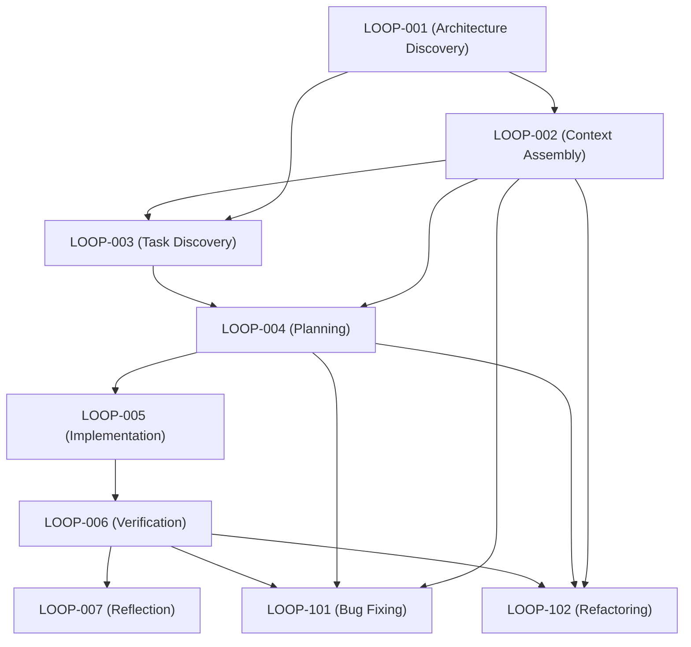
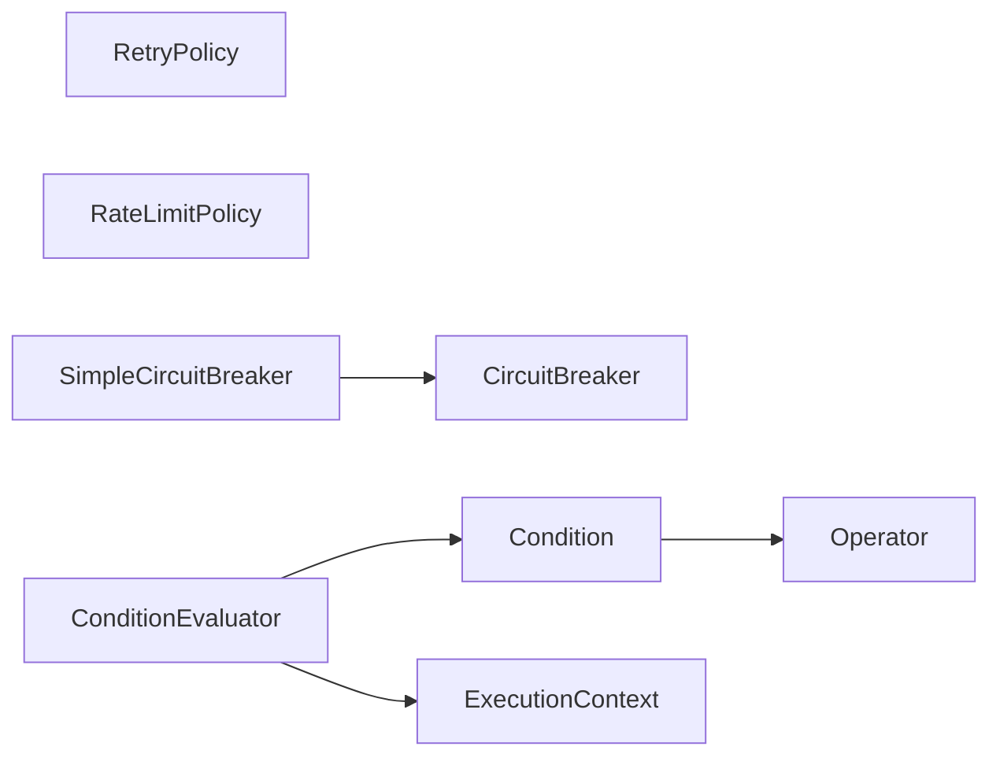

# Dependency Graph

This document details the dependencies between different loops and components in the Loop Engineering Framework.

## 1. Loop Specification Chains

Below is the execution flow and dependency chain of the core loops:

## 2. Decoupled Java Module Dependency Graph

The harvested code structure has zero circular dependencies and is isolated from the `Conductor` application core:

