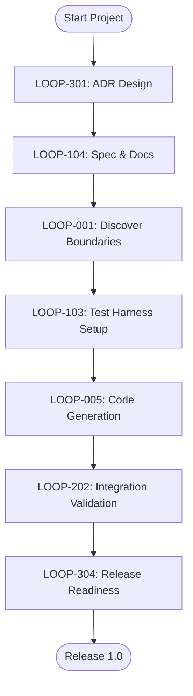
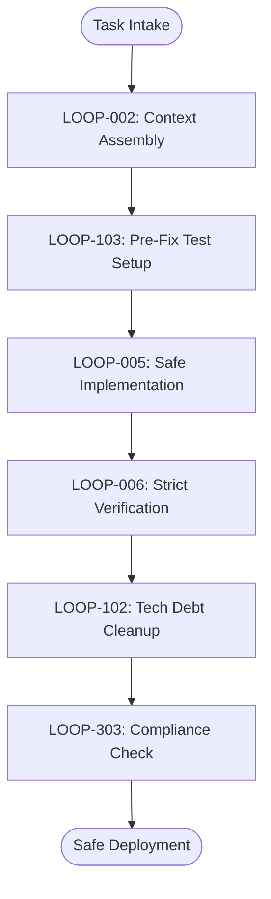
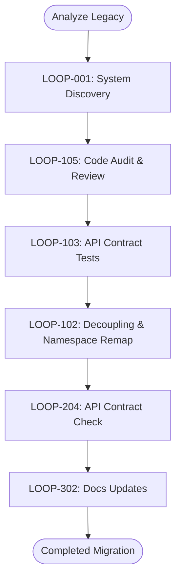
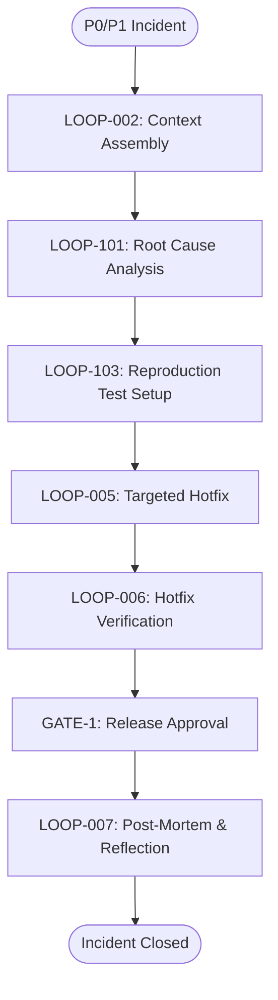
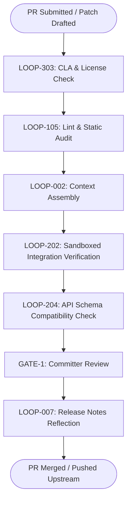
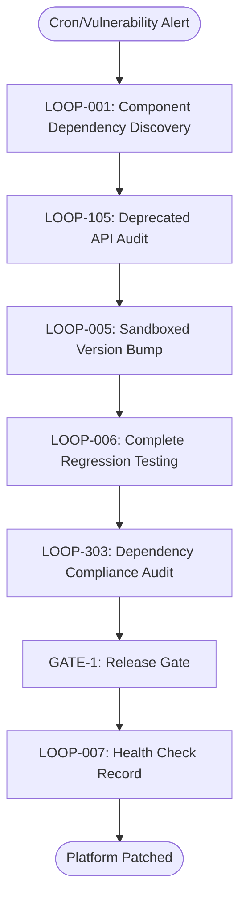

# Project Loops Ready Reckoner

This guide is a practical playbook and ready reckoner for applying the RajaJeevanLoopEngineering General Purpose Loop Engineering Framework across various software project models. It maps out sequential execution paths, provides copy-pasteable configuration templates, and lists deployment instructions to run structured loops safely.

---

## 1. Overview & Philosophy (The 5 Ws and 1 H)

Loop engineering replaces open-ended AI prompting with state-bound, auditable execution cycles governed by **Maker/Checker** roles and human approval gates.

```
                  ┌──────────────────────┐
                  │    Core Orchestrator │
                  └──────────┬───────────┘
                             │
       ┌─────────────────────┼─────────────────────┐
       ▼                     ▼                     ▼
[ Greenfield ]         [ Brownfield ]       [ Modernization ]
Create Architecture    Add Features         Decompose & Refactor
       │                     │                     │
       ▼                     ▼                     ▼
[ Open Source ]        [ Incident Response ] [ Sustaining Eng. ]
Ingest PRs & Audit     Immediate Hotfix     Dependency Patching
```

### Who Uses This?
*   **Developers & AI Agents (Makers):** To implement code changes, test suites, or documentation under deterministic constraints.
*   **Reviewers (Checkers):** To audit code quality, lint compliance, security vulnerabilities, and API boundaries.
*   **Architects & Gatekeepers:** To approve system designs, schema migrations, and code promotion.

### What is It?
A formal mapping of the RajaJeevanLoopEngineering Loop Catalog into repeatable pipelines suited for specific codebase maturity levels.

### Why Use It?
*   **Prevent Regression:** Every change requires verification before merge.
*   **Avoid Over-Engineering:** Restricts AI agents from making speculative abstractions.
*   **Enforce Safety:** Prevents unchecked modifications to critical paths.

### When to Trigger?
*   **Greenfield:** On repository initialization, API design, or component scaffolding.
*   **Brownfield:** On new feature requests, functional bug fixes, and minor refactors.
*   **Modernization:** During monolith-to-microservice splits, dependency upgrades, or technical debt remediation.
*   **Incident Response:** When patching production defects under high urgency.
*   **Open Source Contributions:** Upon receiving external pull requests or submitting patches upstream.
*   **Maintenance & Sustaining:** For scheduled dependency bumps, CVE remediation, and general repository health checks.

### Where is it Run?
In sandboxed developer environments, isolated unit test branches, and continuous integration (CI) environments.

### How is it Governed?
Through **Hard Gates (GATE-1)** (unconditional block requiring human sign-off) and **Soft Gates (GATE-2)** (warning/pause with fallback timeouts).

---

## 2. Greenfield Projects Workflow

### The Context
Greenfield projects start with a clean slate. The focus is on establishing clear architectural boundaries, bootstrapping configuration, and generating documentation/tests before writing application logic.

### Holistic Loop Sequence


### Sequential Execution Playbook

| Step | Loop ID & File Link | Objective | Input Artefacts | Output Artefacts | Key Gate / Guardrail |
| :--- | :--- | :--- | :--- | :--- | :--- |
| **1** | [LOOP-301 — ADR Generation](../loops/governance/LOOP-301-ADR-Generation.md) | Formulate core architectural decisions. | Business constraints, target stack description | Architectural Decision Record (ADR) | **GATE-1:** Principal approval of target tech stack and database choices. |
| **2** | [LOOP-104 — Documentation](../loops/engineering/LOOP-104-Documentation.md) | Author API contracts and specs first. | Approved ADR | OpenAPI schemas, Module Catalog, readme | **GATE-1:** API Contract validation check. |
| **3** | [LOOP-001 — Architecture Discovery](../loops/core/LOOP-001-Architecture-Discovery.md) | Parse workspace structure to establish boundaries. | Initial workspace directories | `dependency-map.md`, `technology-stack.md` | **GATE-2:** Warn if unexpected external frameworks are identified. |
| **4** | [LOOP-103 — Test Generation](../loops/engineering/LOOP-103-Test-Generation.md) | Generate interface test harnesses (Test-First). | OpenAPI schema, module contracts | Unit & Mock Test templates | Assert that mock responses conform strictly to documentation. |
| **5** | [LOOP-005 — Implementation](../loops/core/LOOP-005-Implementation.md) | Code generation matching specs and passing tests. | Context package, task details, test harness | Source code files, code check-ins | Enforce YAGNI: do not implement classes not in the approved spec. |
| **6** | [LOOP-202 — Integration Validation](../loops/platform/LOOP-202-Integration-Validation.md) | Verify integration between newly built modules. | Compiled classes, module catalog | Integration test reports | **GATE-1:** 100% test pass required. |
| **7** | [LOOP-304 — Release Readiness](../loops/governance/LOOP-304-Release-Readiness.md) | Ensure project builds clean, docs are sync'd, and ready to tag. | Git delta, test run status | Verification scorecard | **GATE-1:** Compliance check and security scans. |

---

## 3. Brownfield Projects Workflow

### The Context
Brownfield projects involve modifying or extending pre-existing codebases. The core challenge is context isolation and preventing regressions. Changes must be minimal and tightly localized.

### Holistic Loop Sequence


### Sequential Execution Playbook

| Step | Loop ID & File Link | Objective | Input Artefacts | Output Artefacts | Key Gate / Guardrail |
| :--- | :--- | :--- | :--- | :--- | :--- |
| **1** | [LOOP-002 — Context Assembly](../loops/core/LOOP-002-Context-Assembly.md) | Locate exact files, functions, and files affected. | Feature/Bug task description, codebase | `context-package.md`, `implementation-context.md` | Parse imports to map dependencies; alert on boundary crossing. |
| **2** | [LOOP-103 — Test Generation](../loops/engineering/LOOP-103-Test-Generation.md) | Create regression tests matching current behavior. | Unmodified target code, spec sheet | Regression test files | Capture behavior invariants before introducing modifications. |
| **3** | [LOOP-005 — Implementation](../loops/core/LOOP-005-Implementation.md) | Implement modifications using the Maker role. | `execution-plan.md`, test cases | Code diff, modified files | Scope control: reject any edits outside target files. |
| **4** | [LOOP-006 — Verification](../loops/core/LOOP-006-Verification.md) | Validate tests and ensure no regression exists. | Implementation diff, verification suite | `verification-report.md` | **GATE-1:** Verification confidence score must exceed `90%`. |
| **5** | [LOOP-102 — Refactoring](../loops/engineering/LOOP-102-Refactoring.md) | Clean up adjacent tech debt touched by the change. | Modified code, code quality report | Cleaner code structure (no behavior edits) | **GATE-1:** Prohibited from altering public API signatures. |
| **6** | [LOOP-303 — Compliance](../loops/governance/LOOP-303-Compliance.md) | Audit security policies and dependency licensing. | Final change set, project configuration | Compliance report | **GATE-1:** 0 credentials leaks or GPL imports allowed. |

---

## 4. Modernization Projects Workflow

### The Context
Modernization focuses on decomposing monolithic legacy codebases, upgrading deprecated dependencies, remediating legacy security issues, and aligning components with target architectures.

### Holistic Loop Sequence


### Sequential Execution Playbook

| Step | Loop ID & File Link | Objective | Input Artefacts | Output Artefacts | Key Gate / Guardrail |
| :--- | :--- | :--- | :--- | :--- | :--- |
| **1** | [LOOP-001 — Architecture Discovery](../loops/core/LOOP-001-Architecture-Discovery.md) | Map legacy application components. | Unstructured legacy source directories | Component maps, module catalog | Generate a graphical dependency tree identifying circular references. |
| **2** | [LOOP-105 — Code Review](../loops/engineering/LOOP-105-Code-Review.md) | Audit legacy files for code smells and deprecation. | Target source modules | Technical debt inventory | Identify files containing > 500 lines or complex cyclomatic paths. |
| **3** | [LOOP-103 — Test Generation](../loops/engineering/LOOP-103-Test-Generation.md) | Establish high-coverage integration tests around target boundaries. | Existing system interfaces | API boundary/contract tests | Build tests ensuring that legacy outputs map 1:1 with modernized outputs. |
| **4** | [LOOP-102 — Refactoring](../loops/engineering/LOOP-102-Refactoring.md) | Decouple code, extract modules, and migrate names. | Implementation plan, test boundaries | Modular code files | **GATE-1:** Refactoring must not break contract test suites. |
| **5** | [LOOP-204 — API Contract Validation](../loops/platform/LOOP-204-API-Contract-Validation.md) | Validate modernized API endpoints against legacy behavior. | Dynamic modernized service | API contract evaluation report | **GATE-1:** Strict schema and output equivalence validation. |
| **6** | [LOOP-302 — Documentation Governance](../loops/governance/LOOP-302-Documentation-Governance.md) | Align codebase files, wikis, and markdown with new structure. | Modernized codebase, outdated docs | Synchronized architectural docs | Review and update `README.md` and module mapping. |

---

## 5. Incident Response & Hotfixing

### The Context
An incident occurs when a critical defect impacts production systems. The objective is to deploy a safe, verified fix in the shortest cycle time possible. All secondary updates (refactoring, style edits) are strictly forbidden.

### Holistic Loop Sequence


### Sequential Execution Playbook

| Step | Loop ID & File Link | Objective | Input Artefacts | Output Artefacts | Key Gate / Guardrail |
| :--- | :--- | :--- | :--- | :--- | :--- |
| **1** | [LOOP-002 — Context Assembly](../loops/core/LOOP-002-Context-Assembly.md) | Retrieve relevant error logs, stack traces, and source code. | Stack trace, bug ticket | Isolated target context pack | Limit search strictly to the traceback context. |
| **2** | [LOOP-101 — Bug Fixing](../loops/engineering/LOOP-101-Bug-Fixing.md) | Determine the root cause of the error. | Log analysis, context files | Root Cause Record | **GATE-2:** If root cause is ambiguous, pause and consult logs. |
| **3** | [LOOP-103 — Test Generation](../loops/engineering/LOOP-103-Test-Generation.md) | Create a reproduction test confirming the defect. | Root Cause analysis, target class | Failing test (Red phase) | The test must fail precisely due to the incident symptom. |
| **4** | [LOOP-005 — Implementation](../loops/core/LOOP-005-Implementation.md) | Apply targeted hotfix source change. | Reproduction test, bug fix plan | Source patch | Minimal edit constraint: do not modify unrelated variables/formatting. |
| **5** | [LOOP-006 — Verification](../loops/core/LOOP-006-Verification.md) | Confirm target reproduction test now passes. | Source patch, test suite | `verification-report.md` | **GATE-1:** Verification must pass 100% of integration checks. |
| **6** | [Approval Gate] | Promptly elevate to human gatekeepers for release sign-off. | Complete hotfix patch, test outcomes | Merge authorization | **GATE-1:** Release Manager and Technical Lead sign-off. |
| **7** | [LOOP-007 — Reflection](../loops/core/LOOP-007-Reflection.md) | Author a Post-Mortem and catalog the bug root cause. | Incident metadata, patch logs | Reflection post-mortem document | File long-term action items to refactor the vulnerable module later. |

---

## 6. Open Source Contributions Workflow

### The Context
Ingesting external code contributions or preparing upstream patches carries elevated structural and legal risks. The sequence emphasizes license audits (GPL contamination check), contributor sign-offs, and sandboxed validation of untrusted code.

### Holistic Loop Sequence


### Sequential Execution Playbook

| Step | Loop ID & File Link | Objective | Input Artefacts | Output Artefacts | Key Gate / Guardrail |
| :--- | :--- | :--- | :--- | :--- | :--- |
| **1** | [LOOP-303 — Compliance](../loops/governance/LOOP-303-Compliance.md) | Verify CLA signing and license compatibility. | External PR metadata, license files | Compliance report (License validation) | **GATE-1:** Reject immediately if copyleft/GPL libraries are introduced. |
| **2** | [LOOP-105 — Code Review](../loops/engineering/LOOP-105-Code-Review.md) | Inspect code structure and run static safety/secret scans. | Contributed files, git diff | Static analysis report, vulnerability logs | **GATE-1:** 0 secrets or hardcoded keys allowed. Audit for injection vulnerabilities. |
| **3** | [LOOP-002 — Context Assembly](../loops/core/LOOP-002-Context-Assembly.md) | Scope changed modules to prepare test isolation. | Contributed branch files | Context package | Ensure context is isolated to prevent leakage of internal environment vars. |
| **4** | [LOOP-202 — Integration Validation](../loops/platform/LOOP-202-Integration-Validation.md) | Run testing inside a restricted sandbox environment. | Contributed patch, unit & integration suite | Execution test logs | Execute test commands in isolated containers without repo write secrets. |
| **5** | [LOOP-204 — API Contract Validation](../loops/platform/LOOP-204-API-Contract-Validation.md) | Verify changes do not break existing public API schemas. | Proposed schemas | Compatibility report | **GATE-1:** Breaking public schemas triggers mandatory version bump rules. |
| **6** | [Approval Gate] | Core maintainer performs manual audit and review. | Complete verified PR bundle | Merge approval | **GATE-1:** Review from a designated repo maintainer. |
| **7** | [LOOP-007 — Reflection](../loops/core/LOOP-007-Reflection.md) | Document the contributor credit and update release log. | PR history, reflection input | Release notes snippet | Register contributor attribution in `CHANGELOG.md`. |

---

## 7. Maintenance & Sustaining Engineering Workflow

### The Context
Sustaining engineering is characterized by routine library upgrades (package patch cycles), security patch remediation (CVE resolution), and general health checks. It requires high test coverage to guarantee system stability post-upgrade.

### Holistic Loop Sequence


### Sequential Execution Playbook

| Step | Loop ID & File Link | Objective | Input Artefacts | Output Artefacts | Key Gate / Guardrail |
| :--- | :--- | :--- | :--- | :--- | :--- |
| **1** | [LOOP-001 — Architecture Discovery](../loops/core/LOOP-001-Architecture-Discovery.md) | Map transitive dependency tree and resolve conflicts. | Dependency lock files, build scripts | Updated dependency mapping | Run discovery to ensure components do not have circular dependency locks. |
| **2** | [LOOP-105 — Code Review](../loops/engineering/LOOP-105-Code-Review.md) | Identify if target package upgrades deprecate codebase APIs. | Target upgrade manifest, source code | API usage deprecation audit | Flag internal functions referencing deprecated library methods. |
| **3** | [LOOP-005 — Implementation](../loops/core/LOOP-005-Implementation.md) | Apply library version bump in build settings. | Build files, target upgrade details | Modified build scripts | Upgrades must be isolated. Do not bundle multiple major upgrades together. |
| **4** | [LOOP-006 — Verification](../loops/core/LOOP-006-Verification.md) | Execute complete integration and smoke test suites. | Source patch, target test files | `verification-report.md` | **GATE-1:** Compile checks and 100% test coverage pass is mandatory. |
| **5** | [LOOP-303 — Compliance](../loops/governance/LOOP-303-Compliance.md) | Verify license terms on the new packages. | Newly pulled packages | License audit logs | Confirm library licenses remain compliant with corporate policy. |
| **6** | [Approval Gate] | Run release criteria checks. | Binned test results, CVE resolution data | Deployment release | **GATE-1:** Verification score must hit 100%. |
| **7** | [LOOP-007 — Reflection](../loops/core/LOOP-007-Reflection.md) | Catalog resolved vulnerability IDs (CVEs) and logs. | Patch details | Reflection entry | Record the resolved CVE numbers and upgrade paths for future reference. |

---

## 8. Actionable Snippets & Configurations

### A. Repository Configuration (`.loop-config.yml`)
Place this file in your project's root folder to govern agent constraints.

```yaml
version: "1.0"
governance:
  enforce_maker_checker: true
  min_verification_confidence: 90
  max_iterations_per_run: 3
  prohibited_modules:
    - "infrastructure/security/secrets/*"
    - "platform/auth/keys/*"

rules:
  require_test_before_code: true
  lint_on_save: true
  prevent_public_api_changes_without_gate: true

verification:
  commands:
    lint: "./gradlew spotlessCheck"
    test: "./gradlew test"
    security_scan: "gitleaks detect --source ."
```

### B. Execution Scripts
You can execute and orchestrate loop engines using basic shell scripts.

#### running a single loop pipeline:
```bash
#!/usr/bin/env bash
# run-loop-pipeline.sh
# Usage: ./run-loop-pipeline.sh <task-id> <loop-type>

TASK_ID=$1
LOOP_TYPE=$2

echo "Initializing $LOOP_TYPE Pipeline for task: $TASK_ID"

# Step 1: Context Assembly
echo "Executing LOOP-002 (Context Assembly)..."
./gradlew :loop-engine:run --args="--loop=LOOP-002 --task=$TASK_ID"
if [ $? -ne 0 ]; then
    echo "Context Assembly Failed."
    exit 1
fi

# Step 2: Capability Execution (e.g. Bug Fixing or Refactoring)
echo "Executing $LOOP_TYPE..."
./gradlew :loop-engine:run --args="--loop=$LOOP_TYPE --task=$TASK_ID"
if [ $? -ne 0 ]; then
    echo "$LOOP_TYPE execution encountered errors."
    exit 1
fi

# Step 3: Run Verification Gates
echo "Executing LOOP-006 (Verification)..."
./gradlew :loop-engine:run --args="--loop=LOOP-006 --task=$TASK_ID"
if [ $? -ne 0 ]; then
    echo "Verification checks failed. Reverting changes."
    git checkout -- .
    exit 1
fi

# Step 4: Reflection
./gradlew :loop-engine:run --args="--loop=LOOP-007 --task=$TASK_ID"

echo "Loop pipeline executed successfully!"
```

### C. Agent Prompt Snippet (Maker/Checker)

#### Maker Prompt:
```markdown
System: You are the Loop Maker Agent. Your objective is to modify source code in target files to resolve the specified issue.
Target File: [Insert File Link]
Issue: [Insert Bug Description]

Constraints:
- You must write the test case first before correcting the class logic.
- Do not make speculative imports or modifications outside the file.
- Keep variables named clearly in SCREAMING_SNAKE_CASE for constants.
```

#### Checker Prompt:
```markdown
System: You are the Loop Checker Agent. Your goal is to review the code generated by the Maker Agent.
Maker Diff: [Insert Diff]

Checklist:
1. Does the code compile cleanly without warnings?
2. Are there any hidden credentials or hardcoded keys?
3. Does the implementation violate any boundary limits (e.g., utility class calling database controller)?
4. Return a Confidence Score from 0 to 100 with clear reasoning.
```

---

## 9. Deployment & Automation Guide

Integrating the Loop Library into a new target project is a straightforward process:

```
[Target Project]
 ├── .loop-config.yml                   <-- Add configuration
 ├── RajaJeevanLoopEngineering/      <-- Copy loop catalog & engine
 └── scripts/run-loop-pipeline.sh       <-- Setup pipeline hooks
```

### Step 1: Clone or Copy Library
Copy the `RajaJeevanLoopEngineering` folder to the root directory of your target repository.

### Step 2: Configure Rules
Add a `.loop-config.yml` configuration block to the root of your target project. Ensure you customize the `verification.commands` keys to match your project's build systems (e.g., Maven, NPM, Poetry).

### Step 3: Integrate with Git Pre-Commit Hooks
Run verification and compliance audits locally before every developer commits. Add the following command to `.git/hooks/pre-commit`:
```bash
# Verify formatting and credentials scan
./gradlew spotlessCheck && gitleaks detect --source .
```

### Step 4: Configure CI/CD Pipeline Gates
In your CI/CD configuration (such as GitHub Actions, GitLab CI, or Jenkins), call your loop runner to verify all merge requests:
```yaml
# Example GitHub Actions Step
- name: Run Loop Verification
  run: |
    ./RajaJeevanLoopEngineering/code/gradlew -p RajaJeevanLoopEngineering/code test
    ./scripts/run-loop-pipeline.sh ${{ github.event.pull_request.number }} LOOP-105
```
This forces all agent modifications and human PR contributions to be systematically scored and validated before merge approval.

## Additional Assorted Loops

| Step | Loop ID & File Link | Objective | Input Artefacts | Output Artefacts | Key Gate / Guardrail |
| :--- | :--- | :--- | :--- | :--- | :--- |
| **+** | [LOOP-008 — Loop Creation](../loops/core/LOOP-008-Loop-Creation.md) | End-to-end loop creation based on user prompt | User prompt | LOOP-XXX.md file, updated catalogs | Ensure no duplicate loop exists |
| **+** | [LOOP-009 — Systematic Analysis and Design](../loops/core/LOOP-009-Systematic-Analysis-and-Design.md) | Reusable reasoning framework to systematically transform any subject into enterprise-grade analysis and design | User prompt topic, optional context/constraints | `analysis-and-design-LOOP-009.md` file, updated catalogs | Strict 15-section Output Contract verification |
| **+** | [LOOP-107 — Minimal System Diagram Generation](../loops/engineering/LOOP-107-Minimal-System-Diagram-Generation.md) | Generate system diagrams | Codebase context | Architecture diagrams | Verify diagram matches current state |
| **+** | [LOOP-408 — Delivery Change Steward](../loops/release/LOOP-408-Delivery-Change-Steward.md) | Oversee delivery changes | Release notes | Delivery approvals | GATE-1: Release sign-off |
| **+** | [LOOP-502 — Product Intelligence Architect](../loops/strategy/LOOP-502-Product-Intelligence-Architect.md) | Strategic product intelligence | Market/Product data | Strategic insights | Review by product owners |
| **+** | [LOOP-503 — Roadmap Prioritization](../loops/strategy/LOOP-503-Roadmap-Prioritization.md) | Product Roadmap generation | Ranked Opportunities | Prioritized Backlog | Approval from Stakeholders |
| **+** | [LOOP-504 — Knowledge Integrity Steward](../loops/strategy/LOOP-504-Knowledge-Integrity-Steward.md) | Ensure documentation integrity | Wiki/Docs | Verified knowledge base | Must pass knowledge consistency checks |
| **+** | [LOOP-505 — Feature Definition](../loops/strategy/LOOP-505-Feature-Definition.md) | Feature definition & PRD generation | Roadmap item | PRD, Wireframes | PRD Approval |
| **+** | [LOOP-506 — Go-To-Market Orchestration](../loops/strategy/LOOP-506-Go-To-Market-Orchestration.md) | GTM strategy and launch planning | Feature status | GTM Strategy, Launch Plan | Launch Plan Approval |
| **+** | [LOOP-507 — Self-Improving Product Management](../loops/strategy/LOOP-507-Self-Improving-Product-Management.md) | Self-Improving Product Management | PM Triggers | PM Artifacts & Reports | PM Approval Gate |
| **LOOP-106** | Customer Journey Analytics | Engineering | Medium | LOOP-002 — Context Assembly, LOOP-006 — Verification | Auto-generated standard template execution for Customer Journey Analytics. |
| **LOOP-110** | Legacy Strangler | Engineering | Medium | LOOP-002 — Context Assembly, LOOP-004 — Planning, LOOP-006 — Verification | Auto-generated standard template execution for Legacy Strangler. |
| **LOOP-111** | Technical Debt Remediation | Engineering | Medium | LOOP-002 — Context Assembly, LOOP-004 — Planning, LOOP-006 — Verification | Auto-generated standard template execution for Technical Debt Remediation. |
| **LOOP-112** | Component Deprecation Lifecycle | Engineering | Medium | LOOP-002 — Context Assembly, LOOP-004 — Planning, LOOP-006 — Verification | Auto-generated standard template execution for Component Deprecation Lifecycle. |
| **LOOP-113** | Dead Code Elimination | Engineering | Medium | LOOP-002 — Context Assembly, LOOP-004 — Planning, LOOP-006 — Verification | Auto-generated standard template execution for Dead Code Elimination. |
| **LOOP-130** | Localization and Internationalization Audit | Engineering | Medium | LOOP-002 — Context Assembly, LOOP-004 — Planning, LOOP-006 — Verification | Auto-generated standard template execution for Localization and Internationalization Audit. |
| **LOOP-150** | Dependency Patching | Engineering | Medium | LOOP-002 — Context Assembly, LOOP-004 — Planning, LOOP-006 — Verification | Auto-generated standard template execution for Dependency Patching. |
| **LOOP-160** | Database Deadlock Resolution | Engineering | Medium | LOOP-002 — Context Assembly, LOOP-004 — Planning, LOOP-006 — Verification | Auto-generated standard template execution for Database Deadlock Resolution. |
| **LOOP-161** | Memory Leak Detection | Engineering | Medium | LOOP-002 — Context Assembly, LOOP-004 — Planning, LOOP-006 — Verification | Auto-generated standard template execution for Memory Leak Detection. |
| **LOOP-170** | Zero-Trust Token Rotation | Engineering | Medium | LOOP-002 — Context Assembly, LOOP-004 — Planning, LOOP-006 — Verification | Auto-generated standard template execution for Zero-Trust Token Rotation. |
| **LOOP-171** | Secrets Lifecycle Enforcement | Engineering | Medium | LOOP-002 — Context Assembly, LOOP-004 — Planning, LOOP-006 — Verification | Auto-generated standard template execution for Secrets Lifecycle Enforcement. |
| **LOOP-180** | Environment Drift Audit | Engineering | Medium | LOOP-002 — Context Assembly, LOOP-004 — Planning, LOOP-006 — Verification | Auto-generated standard template execution for Environment Drift Audit. |
| **LOOP-181** | Container Layer Optimization | Engineering | Medium | LOOP-002 — Context Assembly, LOOP-004 — Planning, LOOP-006 — Verification | Auto-generated standard template execution for Container Layer Optimization. |
| **LOOP-305** | Telemetry Compliance | Governance | Medium | LOOP-006 — Verification | Auto-generated standard template execution for Telemetry Compliance. |
| **LOOP-306** | SaaS Cost Optimization | Governance | Medium | LOOP-007 — Reflection | Auto-generated standard template execution for SaaS Cost Optimization. |
| **LOOP-307** | Regulatory Compliance Drift | Governance | Medium | LOOP-006 — Verification | Auto-generated standard template execution for Regulatory Compliance Drift. |
| **LOOP-308** | Contract-to-Code Enforcement | Governance | Medium | LOOP-006 — Verification | Auto-generated standard template execution for Contract-to-Code Enforcement. |
| **LOOP-309** | License Compliance Audit | Governance | Medium | LOOP-006 — Verification | Auto-generated standard template execution for License Compliance Audit. |
| **LOOP-310** | Infrastructure Cost Attribution | Governance | Medium | LOOP-007 — Reflection | Auto-generated standard template execution for Infrastructure Cost Attribution. |
| **LOOP-311** | Feature Access Entitlement | Governance | Medium | LOOP-006 — Verification | Auto-generated standard template execution for Feature Access Entitlement. |
| **LOOP-312** | Data Privacy Anonymization | Governance | Medium | LOOP-006 — Verification | Auto-generated standard template execution for Data Privacy Anonymization. |
| **LOOP-205** | Multi-Tenant Isolation Audit | Platform | Medium | LOOP-006 — Verification | Auto-generated standard template execution for Multi-Tenant Isolation Audit. |
| **LOOP-206** | Observability Validation | Platform | Medium | LOOP-005 — Implementation | Auto-generated standard template execution for Observability Validation. |
| **LOOP-207** | Security Validation | Platform | Medium | LOOP-006 — Verification | Auto-generated standard template execution for Security Validation. |
| **LOOP-208** | Data Migration | Platform | Medium | LOOP-006 — Verification | Auto-generated standard template execution for Data Migration. |
| **LOOP-209** | Partner API Degradation | Platform | Medium | LOOP-006 — Verification | Auto-generated standard template execution for Partner API Degradation. |
| **LOOP-210** | API Shadow IT Discovery | Platform | Medium | LOOP-006 — Verification | Auto-generated standard template execution for API Shadow IT Discovery. |
| **LOOP-211** | FinOps Cloud Bursting | Platform | Medium | LOOP-006 — Verification | Auto-generated standard template execution for FinOps Cloud Bursting. |
| **LOOP-212** | Chaos Engineering Resilience | Platform | Medium | LOOP-006 — Verification | Auto-generated standard template execution for Chaos Engineering Resilience. |
| **LOOP-213** | Multi-Region State Sync | Platform | Medium | LOOP-006 — Verification | Auto-generated standard template execution for Multi-Region State Sync. |
| **LOOP-214** | Resource Quota Guardrail | Platform | Medium | LOOP-006 — Verification | Auto-generated standard template execution for Resource Quota Guardrail. |
| **LOOP-215** | Secret Leakage Prevention | Platform | Medium | LOOP-006 — Verification | Auto-generated standard template execution for Secret Leakage Prevention. |
| **LOOP-216** | Database Index Optimization | Platform | Medium | LOOP-006 — Verification | Auto-generated standard template execution for Database Index Optimization. |
| **LOOP-217** | System Event Idempotency | Platform | Medium | LOOP-006 — Verification | Auto-generated standard template execution for System Event Idempotency. |
| **LOOP-218** | Backward Compatibility Verification | Platform | Medium | LOOP-006 — Verification | Auto-generated standard template execution for Backward Compatibility Verification. |
| **LOOP-219** | Load Balancing Anomaly Mitigation | Platform | Medium | LOOP-006 — Verification | Auto-generated standard template execution for Load Balancing Anomaly Mitigation. |
| **LOOP-220** | API Rate Limiting Guardrail | Platform | Medium | LOOP-006 — Verification | Auto-generated standard template execution for API Rate Limiting Guardrail. |
| **LOOP-221** | Accessibility Compliance Guardrail | Platform | Medium | LOOP-006 — Verification | Auto-generated standard template execution for Accessibility Compliance Guardrail. |
| **LOOP-222** | Telemetry Anomaly Detection | Platform | Medium | LOOP-006 — Verification | Auto-generated standard template execution for Telemetry Anomaly Detection. |
| **LOOP-223** | Multi-Cloud Disaster Recovery | Platform | Medium | LOOP-006 — Verification | Auto-generated standard template execution for Multi-Cloud Disaster Recovery. |
| **LOOP-224** | Edge Cache Invalidation | Platform | Medium | LOOP-006 — Verification | Auto-generated standard template execution for Edge Cache Invalidation. |
| **LOOP-225** | Cross-Site Scripting Guardrail | Platform | Medium | LOOP-006 — Verification | Auto-generated standard template execution for Cross-Site Scripting Guardrail. |
| **LOOP-226** | Tenant Onboarding Validation | Platform | Medium | LOOP-006 — Verification | Auto-generated standard template execution for Tenant Onboarding Validation. |
| **LOOP-227** | Third-Party Webhook Reliability | Platform | Medium | LOOP-006 — Verification | Auto-generated standard template execution for Third-Party Webhook Reliability. |
| **LOOP-228** | Log Aggregation Sanity | Platform | Medium | LOOP-006 — Verification | Auto-generated standard template execution for Log Aggregation Sanity. |
| **LOOP-401** | Release Checklist | Release | Medium | LOOP-304 — Release Readiness | Auto-generated standard template execution for Release Checklist. |
| **LOOP-402** | Deployment Validation | Release | Medium | LOOP-401 — Release Checklist | Auto-generated standard template execution for Deployment Validation. |
| **LOOP-403** | Post-Release Verification | Release | Medium | LOOP-402 — Deployment Validation | Auto-generated standard template execution for Post-Release Verification. |
| **LOOP-404** | Feature Flag Lifecycle | Release | Medium | LOOP-006 — Verification, LOOP-007 — Reflection | Auto-generated standard template execution for Feature Flag Lifecycle. |
| **LOOP-405** | Experimentation Guardrail | Release | Medium | LOOP-006 — Verification | Auto-generated standard template execution for Experimentation Guardrail. |
| **LOOP-406** | Edge Deployment Rollback | Release | Medium | LOOP-006 — Verification | Auto-generated standard template execution for Edge Deployment Rollback. |
| **LOOP-407** | Synthetic User Verification | Release | Medium | LOOP-006 — Verification | Auto-generated standard template execution for Synthetic User Verification. |
